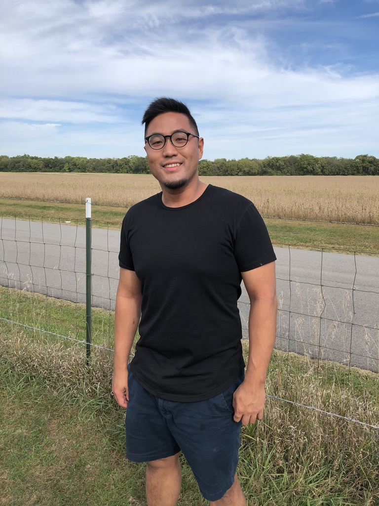

{:height="350px" .callout}
I am currently a research scientist working at Meta Platform Inc. My job is about optimizing user intent models to benefit ads ranking systems. I earned my PhD in the field of Natural Language Processing (NLP) at Department of Computer Science of Purdue University on 2020 under the advice of [Dr. Dan Goldwasser](https://www.cs.purdue.edu/homes/dgoldwas/). 

I specialize in narrative understanding, common sense modeling, and script/event representation learning, tackling the problems that require Natural Language Understanding (NLU) and Machine Learning techniques. My PhD thesis focused on constructing commonsense models with Statistical Script Learning, whose core concept is predicting “what happens next.” Specifically, the models predict the next event given what have happened in the past. Imagine that your Siri can guess what you want without explicitly commanding. 

My career goal is to realize machine common sense in real-world applications such that better machine-human communications can happen. I endeavor to share my expertise through innovative works with engineers and information scientists all over the global.

### My Resume

[Download](/download/resume.pdf)
